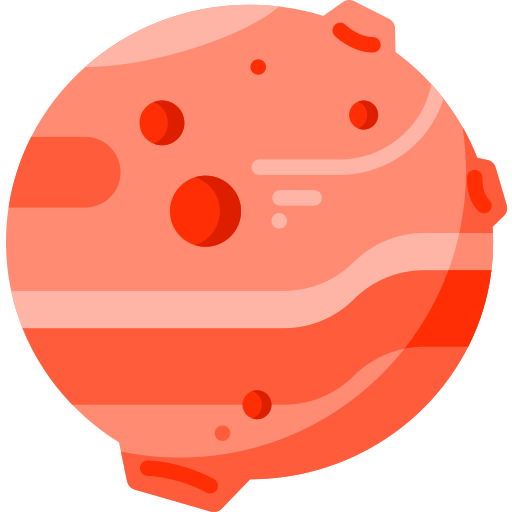

<div align="center">



# Martian Launcher

**A modern Minecraft: Java Edition launcher for Android**

[](https://github.com/foxstudio-201/martianlauncher-adr/releases)
[](https://github.com/foxstudio-201/martianlauncher-adr/stargazers)
[](LICENSE)
[](https://voxelx.io.vn)

</div>

> [!IMPORTANT]
> This project is a **fork of** [ZalithLauncher2](https://github.com/ZalithLauncher/ZalithLauncher2). It is **not affiliated** with the official project.

**Martian Launcher** is a newly designed launcher for **Android devices**, tailored for [Minecraft: Java Edition](https://www.minecraft.net/). It uses [PojavLauncher](https://github.com/PojavLauncherTeam/PojavLauncher/tree/v3_openjdk/app_pojavlauncher/src/main/jni) as its core launching engine and [Zalith Launcher 2](https://github.com/ZalithLauncher/ZalithLauncher2) as its base source code, with a modern UI built on **Jetpack Compose** and **Material Design 3**.

We are currently building our official website: **[voxelx.io.vn](https://voxelx.io.vn)**

> [!WARNING]
> A third-party website using the name "Martian Launcher" has appeared, pretending to be official. **It was not created by us** — it exploits the name to display ads for profit. We **do not participate in, endorse, or trust** such content. Please stay vigilant and **protect your personal privacy**!

[Discord Server Shutdown Announcement](/.github/notice/DiscordStatus.md)

##  Features

- Launch **Minecraft: Java Edition** on Android, powered by the PojavLauncher engine
- Modern UI built with **Jetpack Compose** + **Material Design 3**
- Browse & install **Modpacks, Mods, Resource Packs, Saves and Shaders**
- Customizable **on-screen controls** and physical **gamepad** support
- Multiplayer support via **Terracotta**
- Multiple mod loaders: **Forge, NeoForge, Fabric, Quilt, OptiFine**

##  Language and Translation Support

We use the Weblate platform to translate Martian Launcher. You're welcome to join our [Weblate project](https://hosted.weblate.org/projects/martianlauncher2) and contribute to the translations!

Thank you to every language contributor for helping make Martian Launcher more multilingual and global!

##  Build Instructions (For Developers)

> The following section is for developers who wish to contribute or build the project locally.

### Requirements

| Tool | Version |
|------|---------|
| Android Studio | **Bumblebee** or newer |
| Android SDK — Minimum API | **26** |
| Android SDK — Target API | **35** |
| JDK | **11** |

### Build Steps

```bash
git clone git@github.com:foxstudio-201/martianlauncher-adr.git
# Open the project in Android Studio and build
```

##  License

This project is licensed under the **[GPL-3.0 license](LICENSE)**.

### Additional Terms (Pursuant to Section 7 of the GPLv3 License)

1. When distributing a modified version of this program, you must reasonably modify the program's name or version number to distinguish it from the original version. (According to [GPLv3, 7(c)](https://github.com/foxstudio-201/martianlauncher-adr/blob/969827b/LICENSE#L372-L374))
    - Modified versions **must not include the original program name "MartianLauncher" or its abbreviation "MT" in their name, nor use any name that is similar enough to cause confusion with the official name**.
    - All modified versions **must clearly indicate that they are “Unofficial Modified Versions” on the program’s startup screen or main interface**.
    - The application name of the program can be modified in [gradle.properties](./MartianLauncher/gradle.properties).

2. You must not remove the copyright notices displayed by the program. (According to [GPLv3, 7(b)](https://github.com/foxstudio-201/martianlauncher-adr/blob/969827b/LICENSE#L368-L370))

##  Open Source Libraries and Licenses

This software uses the following open source libraries:

| Library                               | Copyright                                                                                                     | License              | Official Link                                                                     |
|---------------------------------------|---------------------------------------------------------------------------------------------------------------|----------------------|-----------------------------------------------------------------------------------|
| androidx-constraintlayout-compose     | Copyright © The Android Open Source Project                                                                   | Apache 2.0           | [Link](https://developer.android.com/develop/ui/compose/layouts/constraintlayout) |
| androidx-material-icons-core          | Copyright © The Android Open Source Project                                                                   | Apache 2.0           | [Link](https://developer.android.com/jetpack/androidx/releases/compose-material)  |
| androidx-material-icons-extended      | Copyright © The Android Open Source Project                                                                   | Apache 2.0           | [Link](https://developer.android.com/jetpack/androidx/releases/compose-material)  |
| ANGLE                                 | Copyright 2018 The ANGLE Project Authors                                                                      | BSD 3-Clause License | [Link](http://angleproject.org/)                                                  |
| Apache Commons Codec                  | -                                                                                                             | Apache 2.0           | [Link](https://commons.apache.org/proper/commons-codec)                           |
| Apache Commons Compress               | -                                                                                                             | Apache 2.0           | [Link](https://commons.apache.org/proper/commons-compress)                        |
| Apache Commons IO                     | -                                                                                                             | Apache 2.0           | [Link](https://commons.apache.org/proper/commons-io)                              |
| ByteHook                              | Copyright © 2020-2024 ByteDance, Inc.                                                                         | MIT License          | [Link](https://github.com/bytedance/bhook)                                        |
| BuildKeys                             | Copyright © 2026 MovTery                                                                                      | Aoache 2.0           | [Link](https://github.com/MovTery/BuildKeys)                                      |
| Coil Compose                          | Copyright © 2025 Coil Contributors                                                                            | Apache 2.0           | [Link](https://github.com/coil-kt/coil)                                           |
| Coil Gifs                             | Copyright © 2025 Coil Contributors                                                                            | Apache 2.0           | [Link](https://github.com/coil-kt/coil)                                           |
| Coil SVG                              | Copyright © 2025 Coil Contributors                                                                            | Apache 2.0           | [Link](https://github.com/coil-kt/coil)                                           |
| Fishnet                               | Copyright © 2025 Kyant                                                                                        | Apache 2.0           | [Link](https://github.com/Kyant0/Fishnet)                                         |
| gl4es_extra_extra                     | Copyright © 2016-2018 Sebastien Chevalier; Copyright (c) 2013-2016 Ryan Hileman                               | MIT License          | [Link](https://github.com/PojavLauncherTeam/gl4es_extra_extra)                    |
| Gson                                  | Copyright © 2008 Google Inc.                                                                                  | Apache 2.0           | [Link](https://github.com/google/gson)                                            |
| kotlinx.coroutines                    | Copyright © 2000-2020 JetBrains s.r.o.                                                                        | Apache 2.0           | [Link](https://github.com/Kotlin/kotlinx.coroutines)                              |
| ktor-client-cio                       | Copyright © 2000-2023 JetBrains s.r.o.                                                                        | Apache 2.0           | [Link](https://ktor.io)                                                           |
| ktor-client-content-negotiation       | Copyright © 2000-2023 JetBrains s.r.o.                                                                        | Apache 2.0           | [Link](https://ktor.io)                                                           |
| ktor-client-core                      | Copyright © 2000-2023 JetBrains s.r.o.                                                                        | Apache 2.0           | [Link](https://ktor.io)                                                           |
| ktor-http                             | Copyright © 2000-2023 JetBrains s.r.o.                                                                        | Apache 2.0           | [Link](https://ktor.io)                                                           |
| ktor-serialization-kotlinx-json       | Copyright © 2000-2023 JetBrains s.r.o.                                                                        | Apache 2.0           | [Link](https://ktor.io)                                                           |
| LWJGL - Lightweight Java Game Library | Copyright © 2012-present Lightweight Java Game Library All rights reserved.                                   | BSD 3-Clause License | [Link](https://github.com/LWJGL/lwjgl3)                                           |
| material-color-utilities              | Copyright 2021 Google LLC                                                                                     | Apache 2.0           | [Link](https://github.com/material-foundation/material-color-utilities)           |
| Maven Artifact                        | Copyright © The Apache Software Foundation                                                                    | Apache 2.0           | [Link](https://github.com/apache/maven/tree/maven-3.9.9/maven-artifact)           |
| Media3                                | Copyright © The Android Open Source Project                                                                   | Apache 2.0           | [Link](https://developer.android.com/jetpack/androidx/releases/media3)            |
| Mesa                                  | Copyright © The Mesa Authors                                                                                  | MIT License          | [Link](https://mesa3d.org/)                                                       |
| MMKV                                  | Copyright © 2018 THL A29 Limited, a Tencent company.                                                          | BSD 3-Clause License | [Link](https://github.com/Tencent/MMKV)                                           |
| Navigation 3                          | Copyright © The Android Open Source Project                                                                   | Apache 2.0           | [Link](https://developer.android.com/jetpack/androidx/releases/navigation3)       |
| NBT                                   | Copyright © 2016 - 2020 Querz                                                                                 | MIT License          | [Link](https://github.com/Querz/NBT)                                              |
| NG-GL4ES                              | Copyright © 2016-2018 Sebastien Chevalier; Copyright © 2013-2016 Ryan Hileman; Copyright (c) 2025-2026 BZLZHH | MIT License          | [Link](https://github.com/BZLZHH/NG-GL4ES)                                        |
| OkHttp                                | Copyright © 2019 Square, Inc.                                                                                 | Apache 2.0           | [Link](https://github.com/square/okhttp)                                          |
| Okio                                  | Copyright © 2013 Square, Inc.                                                                                 | Apache 2.0           | [Link](https://square.github.io/okio/)                                            |
| Process Phoenix                       | Copyright © 2015 Jake Wharton                                                                                 | Apache 2.0           | [Link](https://github.com/JakeWharton/ProcessPhoenix)                             |
| proxy-client-android                  | -                                                                                                             | LGPL-3.0 License     | [Link](https://github.com/TouchController/TouchController)                        |
| Reorderable                           | Copyright © 2023 Calvin Liang                                                                                 | Apache 2.0           | [Link](https://github.com/Calvin-LL/Reorderable)                                  |
| skinview3d                            | Copyright © 2014-2018 Kent Rasmussen; Copyright © 2017-2022 Haowei Wen, Sean Boult and contributors           | MIT License          | [Link](https://github.com/bs-community/skinview3d)                                |
| sora-editor                           | Copyright © 1991, 1999 Free Software Foundation, Inc.                                                         | LGPL-2.1 License     | [Link](https://github.com/Rosemoe/sora-editor)                                    |
| StringFog                             | Copyright © 2016-2023, Megatron King                                                                          | Apache 2.0           | [Link](https://github.com/MegatronKing/StringFog)                                 |
| XZ for Java                           | Copyright © The XZ for Java authors and contributors                                                          | 0BSD License         | [Link](https://tukaani.org/xz/java.html)                                          |
